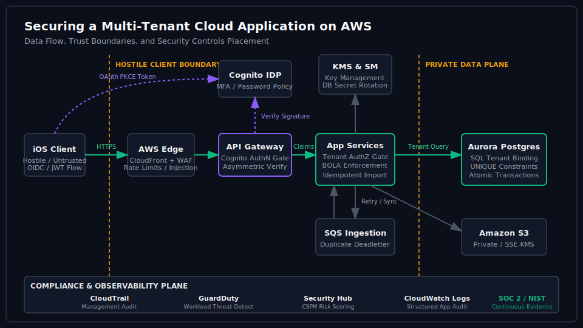

# Cloud Application Security on AWS (`cloudappsecurity`)

> **TL;DR** — A runnable, synthetic-data case study demonstrating how to secure a multi-tenant cloud application. Highlights that database boundaries, tenant-bound resource authorization, stable wearable data ingestion, and log redactions are application-level responsibilities, while AWS-native services (Cognito, WAF, KMS, GuardDuty, and CloudTrail) layer preventive, detective, and recovery controls around that core application boundary.

---

## The Security Thesis

Many engineering teams fall into the trap of "AWS infrastructure theater"—believing a cloud backend is secure simply because they checked the boxes for Cognito, KMS, WAF, GuardDuty, and private subnets. 

The reality is that **these perimeters cannot save you from logical application bugs.** An authenticated user exploiting a Broken Object-Level Authorization (BOLA / IDOR) vulnerability can retrieve another tenant's private workouts, weight records, or race goals through a perfectly configured, fully encrypted VPC database. WAF and KMS do not understand whether "User A is allowed to read Workout B."

This repository presents a runnable, local prototype that demonstrates how to implement and test core application security boundaries—including customer identity validation, object-level tenant isolation, atomic transaction rollbacks, idempotent asynchronous data sync, and redacted audit logging—and documents how these patterns scale and map directly to an enterprise AWS production architecture.

---

## Architecture Blueprint

The application design follows the "public edge, private data plane" model:

```
[ Mobile iOS Client ]  (JWT OAuth PKCE Handshake)
        ↓
    [ AWS WAF ]        (Rate limiting & injection signature inspection)
        ↓
  [ API Gateway ]      (Asymmetric JWT signature, audience, & expiry checks)
        ↓
 [ App Services ]      (Tenant authorization checking sub / BOLA prevention)
        ↓
[ Aurora Postgres ]    (Enforced via UNIQUE constraints & atomic transactions)
```

For a visual breakdown of trust boundaries, control points, and database segregation, refer to [architecture.svg](architecture.svg):



---

## Quickstart

Verify all invariants and run the interactive demo on your machine with **zero external dependencies, zero network requests, and zero AWS credentials**:

### 1. Run the Security Invariant Tests
```bash
pip install -r requirements.txt
pytest -v
```
All 58 tests assert cryptographic, authorization-policy, nested-resource, concurrency, database, rate-limiting, revocation, and containment controls.

### 2. Execute the Interactive Demo
```bash
python3 demo.py
```
Walks through 16 scenario paths—contrasting vulnerable and hardened implementations of legitimate requests and adversarial attacks (such as BOLA, nested/child BOLA, forged tokens, confused-deputy service calls, sync racing, exfiltration, token revocation, and automated containment).

Add `--audit-log` to also print the stored `audit_logs` table, showing exactly how redacted events look at rest:
```bash
python3 demo.py --audit-log
```

---

## What the Case Study Demonstrates

### 1. Cryptographic Identity & Authorization (Phase 1)
- **Token Verification:** Locally simulates Cognito User Pool JWT verification. Signs tokens using a local RSA private key and validates signature, expiry (`exp`), issuer (`iss`), and client audience (`aud`) at the entry gate using only the public key.
- **BOLA/IDOR Prevention:** Demonstrates the BOLA vulnerability by querying resource IDs directly (`WHERE id = ?`). Contrasts it with the hardened query path binding both resource ID and the token's authenticated subject (`WHERE id = ? AND user_id = ?`).
- **Nested (Child) BOLA Prevention:** Child records (`workout_sets`) carry no `user_id`; ownership is derivable only through the parent. The hardened path joins to the parent workout and binds *its* owner, so `/sets/{id}` cannot be probed directly when `/workouts/{id}` is blocked.
- **Stateless Token Revocation:** An edge deny-list (`auth.RevocationList`) keyed by `jti` or subject-`iat` cutoff (Cognito `GlobalSignOut` semantics) resolves the stateless-vs-revocable trade-off — a stolen but valid token is rejected in-band instead of surviving until TTL. Tombstones self-expire at the token's original `exp`.
- **Workload Identity (Service-to-Service):** Simulates an STS AssumeRole / SPIFFE-style token exchange: backend workers attest to an identity broker and receive short-lived, scope-capped service tokens. Blocks unregistered workloads, scope escalation, and the confused-deputy replay of stolen *user* tokens on internal service channels.
- **Policy-as-Code Authorization:** Mocks an OPA/Rego-style policy engine evaluating structured JSON policies against an input document (`subject`, `action`, `resource`) with deny-overrides and default-deny semantics, returning structured decisions (`allow`, `policy_id`, `reason`) for enforcement and audit.

### 2. Data Ingestion & Transaction Integrity (Phase 2)
- **Idempotency Guard:** Models a wearable ingestion pipeline (e.g. Apple Health imports) matching external workout UUIDs. Relies on SQLite unique constraints (`UNIQUE(user_id, source_provider, external_workout_id)`) to handle duplicate syncs or retries, maintaining idempotency.
- **Race Condition Safety:** Simulates concurrent ingestion racing. Proves how database constraints and transaction boundaries prevent double-records without relying on sloppy application checks.
- **Atomic Rollback:** Assures database validation checks. If a write fails validation mid-flight (e.g. invalid distance metrics), the entire transaction aborts, ensuring no partial or corrupted rows persist.
- **Separation of Commit vs Presentation:** Resolves presentation-layer failures (like UI/navigation errors) throwing post-commit. Prevents the API from returning misleading "save failed" messages to clients when the data has already successfully persisted.

### 3. Auditing & Threat Detection (Phase 3)
- **Structured Log Redaction:** Iterates over log payloads and recursively redacts credentials (JWT signatures), personal contact info (emails), and sensitive personal metrics (weight) to prevent credential leakage into monitoring systems.
- **Application Anomaly Engine:** Tracks token usage rates and authorization failure spikes in-memory. Detects BOLA enumeration scans (repeated denials) and bulk data exfiltration attempts.
- **Automated Containment (Incident Response):** A CRITICAL exfiltration alert fires a containment hook that revokes the user's active sessions server-side (the Cognito `AdminUserGlobalSignOut` pattern). The attacker's still-valid JWT is rejected at the session gate on the next request — closing the gap between detection and response, since stateless tokens cannot be un-signed.

---

## Repository Structure

| File / Folder | Purpose |
|---|---|
| [`demo.py`](demo.py) | Interactive CLI script executing all security scenarios. |
| [`requirements.txt`](requirements.txt) | Python dependencies (`pyjwt`, `cryptography`, `pytest`). |
| [`architecture.svg`](architecture.svg) | Dark-mode vector diagram of trust boundaries and control flows. |
| [`cloud_security_case/`](cloud_security_case/) | Core package folder containing logic. |
| ├── [`auth.py`](cloud_security_case/auth.py) | Cognito-simulating JWT issuer/verifier + workload identity token exchange (STS/SPIFFE style). |
| ├── [`authorization.py`](cloud_security_case/authorization.py) | Insecure vs secure query fetchers enforcing tenant isolation + OPA-style policy engine. |
| ├── [`database.py`](cloud_security_case/database.py) | SQLite table schemas, WAL mode config, and transactional blocks. |
| ├── [`imports.py`](cloud_security_case/imports.py) | Wearable import pipeline, validation, and race handling. |
| ├── [`audit.py`](cloud_security_case/audit.py) | Classification-driven, fail-closed PII/JWT log redaction (case/separator-insensitive). |
| ├── [`detection.py`](cloud_security_case/detection.py) | Anomaly engine monitoring access rates and auth failures, with containment hooks. |
| ├── [`containment.py`](cloud_security_case/containment.py) | Automated incident response: server-side session revocation for still-valid JWTs. |
| ├── [`scenarios.py`](cloud_security_case/scenarios.py) | Setup and orchestration of all interactive scenarios and test runs. |
| [`tests/`](tests/) | Unit test files verifying all security invariants. |
| [`infra/terraform/`](infra/terraform/) | Secure, declarative Terraform configuration representing the AWS stack. |
| [`.github/workflows/`](.github/workflows/) | CI workflow file executing tests on pull requests. |

---

## Design and Compliance Documentation

Detailed documentation mapping the code patterns directly to cloud architecture, threat models, and regulatory compliance standards:

1. **[DEMO.md](DEMO.md)** — Step-by-step breakdown of the interactive CLI scenarios, associated threats, and control mechanisms.
2. **[ARCHITECTURE.md](ARCHITECTURE.md)** — In-depth overview of the multi-tenant architecture, trust boundaries, request lifecycles, and failure boundaries.
3. **[THREAT_MODEL.md](THREAT_MODEL.md)** — Structured STRIDE threat model tracking system assets, trust boundaries, attack vectors, and code/production mitigations.
4. **[DECISIONS.md](DECISIONS.md)** — Architectural Decision Records (ADRs) explaining technical trade-offs (e.g. relational DB selection, token verification models, WAL mode, transaction scopes).
5. **[CONTROLS.md](CONTROLS.md)** — Comprehensive control matrix mapping threats to code mechanisms, AWS services, and compliance framework alignments (NIST CSF 2.0 and SOC 2).
6. **[AWS_PRODUCTION_PATH.md](AWS_PRODUCTION_PATH.md)** — Service-by-service transition guide mapping local SQLite and process mock boundaries to AWS-native resources.
7. **[SECURITY_REVIEW.md](SECURITY_REVIEW.md)** — An honest adversarial assessment detailing the limits of the prototype, what is simulated, and residual risks.
8. **[SECURITY_AUDIT.md](SECURITY_AUDIT.md)** — Principal-architect adversarial code audit: nine findings (nested BOLA, brittle redaction, token revocation, sequential-vs-real concurrency, missing PrivateLink/RDS Proxy, and more), each with the fix and open questions.

---

## The Closing Argument

> "Security in the cloud is a partnership. AWS protects the infrastructure, virtualization, and physical hardware (security of the cloud). The application owner must protect the data, identity mappings, transaction boundaries, and access validations (security in the cloud). KMS encryption, private subnets, and WAF rules are excellent perimeter controls, but they cannot save an application that lets Alice fetch Bob's weight history. Core tenant authorization, idempotency, and database constraints must be correct first."

---

## License

MIT. Free to copy, study, and integrate.
